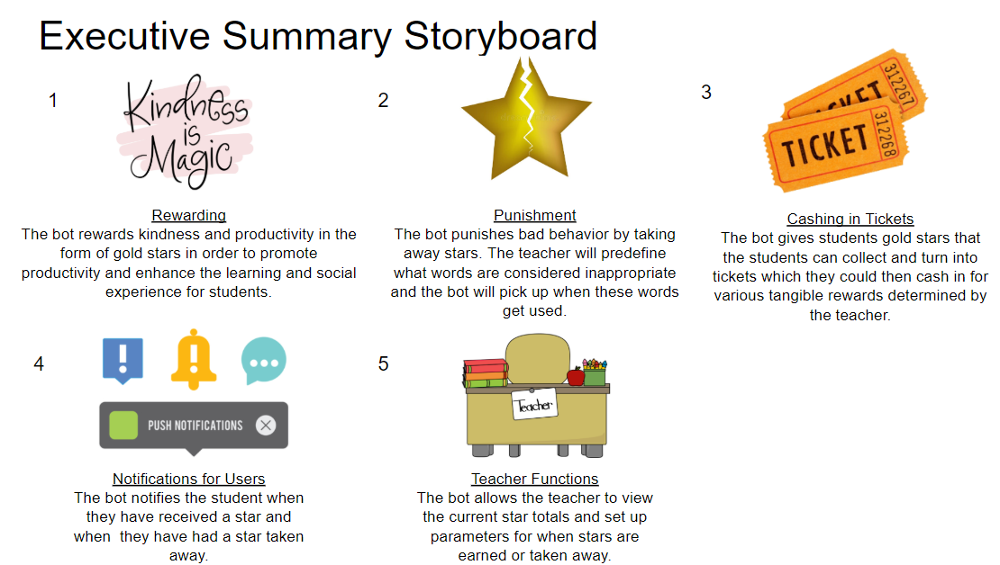
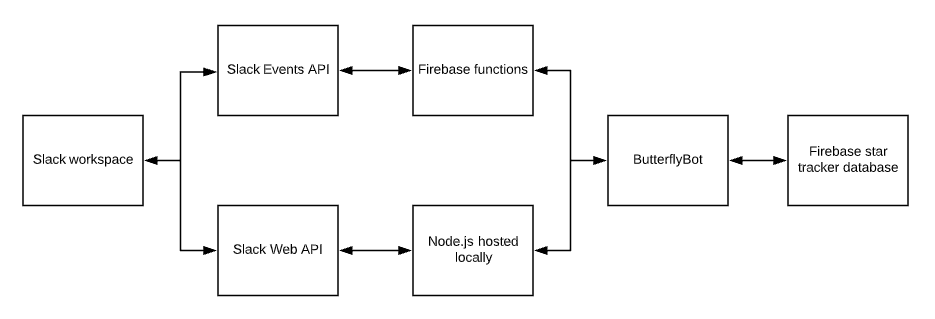

# Butterfly: rewarding students for what matters

### Problem Statement
In today's climate, there are many students getting their academic lives uprooted as they are forced to attend school from home. While this is a somewhat feasible feat for college-aged students, many young learners in elementary and middle school are struggling with not only their educational but also social lives being disrupted. For young children, being socialized is just as important to the classroom experience as their lessons are, and these skills are sometimes referred to as “soft skills.” When students are forced to learn from home, they are not receiving proper socialization and learning those “soft skills” that a classroom is able to provide. While these students are at home with their families, they may be isolated from communicating with kids of their own age and suffering from feelings of isolation.

### Bot Description
Our group is creating a reward bot through Slack. Our take on implementing this is a bot that rewards both kindness and productivity that can be implemented in schools forced to switch to online learning to promote productivity and enhance the learning and social experience for students. The bot would give rewards in the form of gold stars, which could collect to then turn into tickets which they could then cash in for various tangible rewards determined by the teacher. Additionally, our bot will punish bad behavior by taking away stars. There will be an online platform where students can communicate and participate in discussions through various Slack channels dedicated to different functions. We plan on rewarding behavior such as answering other students’ questions that have been posted and discussion participation. Behaviour that would be punished by removing stars would be using unkind or inappropriate language and not participating in discussion.  

This would be a good solution for the current problem of schools switching to online learning to provide a fun and interactive way for students to participate in further discussion and as an additional tool for teachers. The bot primarily responds to events but has a secondary function of having a conversation with users in that it lets students know when they have gained or lost a star and allows the teacher to view the current star totals and set up parameters for when stars are earned or taken away.

### Use Cases
1. A student is rewarded for participating in class
    * **Preconditions:**  
      1. The teacher pre-defines a slack channel.
    * **Main Flow:**
      1. Teacher adds bot to channel
      2. User interacts with the teacher/another student within a channel (e.g. replies to another student’s question in a thread) [S1]
      3. Bot will notify student they are being rewarded with a star in a direct message [S2]
      4. Reward progress will be displayed [S3]
    * **Subflows:**  
      [S1] Student utilizes the “@” function to directly communicate with another student  
      [S2] Bot will record the student being rewarded and update their reward status  
      [S3] The bot will update the total amount of stars that the student has  
    * **Alternate Flows:**  
      [E1] The teacher has not set up a slack channel for students to communicate with each other  
      [E2] The teacher uses “@butterfly” to add the bot to a thread if the bot is not in the entire channel (e.g. to reward students who participate in a discussion thread)  
      [E3] The teacher manually has the bot give a student a star by interacting with the bot  
2. A student is punished for their behavior
    * **Preconditions**
      1. The teacher pre-defines a slack channel for students to communicate within and adds the bot to the channel.
      2. The teacher has prefined what words are considered inappropriate 
    * **Main Flow**  
      1. The user interacts with the teacher/another student within the channel (e.g. The student replies to the teacher’s question/discussion in a thread) and performs an act that is associated with bad behavior [S1]
      2. The bot will notify the student and the teacher that a star has been taken away from the student [S2]
      3. The bot will update the total amount of stars that the student has [S3]
    * **Subflows**  
      [S1] The user utilizes the “@” function to directly communicate with either the teacher or another student and performs an act that is associated with bad behavior  
      [S2] The bot will will remove a star from the student and notify the student and the teacher that a star has been taken away from the student  
      [S3] The bot will update the total amount of stars that the student has  
    * **Alternative Flows**  
      [E1] The teacher has not set up a slack channel for students to communicate with each other  
      [E2] The teacher manually has the bot remove a star from the student

### Design Sketches
Sequence Flow:

Storyboard:

### Architecture Design

Create a diagram that illustrates the components of your bot, the platform it is embedded in, third party services it may use, data storage it may require, etc.
Describe the architecture components in text.
This section should be several paragraphs of text. This is the opportunity to really think through how you might build your system. Consider all the criteria listed here in your description. Generic architectures that do not properly reflect a solution will receive low scores.
