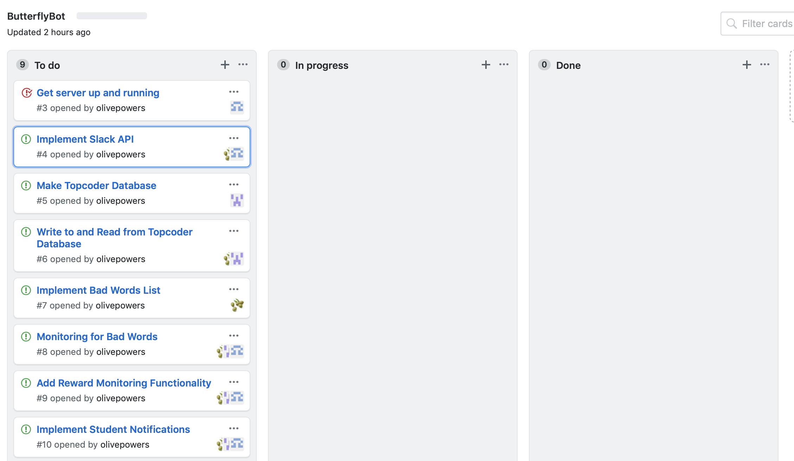
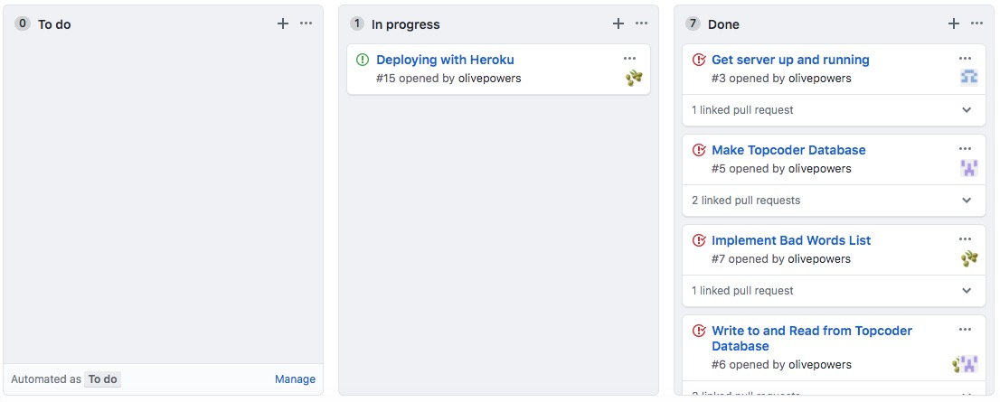

# Butterfly: rewarding students for what matters

### Meeting Notes
The team utilized the repo's wiki to hold all meeting notes. The group held meetings often and found that the meeting notes proved helpful as it was a good way to keep track of their progress, as well as document any issues and realizations they made in the process. The notes for the following meetings are detailed in the linked wiki pages:
* [Wiki Home Page](https://github.com/Angelina-Zaccaria/ButterflyBot/wiki)
* [Meeting on 4/08](https://github.com/Angelina-Zaccaria/ButterflyBot/wiki/Meeting-April-08)
* [Meeting on 4/11](https://github.com/Angelina-Zaccaria/ButterflyBot/wiki/Meeting-April-11)
* [Meeting on 4/14](https://github.com/Angelina-Zaccaria/ButterflyBot/wiki/Meeting-April-14)
* [After Completion Meeting on 4/19](https://github.com/Angelina-Zaccaria/ButterflyBot/wiki/Meeting-April-19)

### Practices - Stories/Tasks
This milestone consisted of two different iterations for the group. The first iteration was focused on the reserach for the project and from this research deciding upon the project functionality. The second iteration was focused on the development and deployment of the milestone tasks. At the end of the first iteration, the group created GitHub issues for each task that they wanted to have completed within the next iteration. For each of these issues, a group member was assigned. The group additionally created a project board and linked each of these issues to the project board. Therefore, at the end of the first iteration, all of the issues assigned were within the "To do" section of the [project board](https://github.com/Angelina-Zaccaria/ButterflyBot/projects/1).

**The group's kanban board after the first iteration:**
  

In the second iteration, the group worked on the tasks assigned for the project at the end of the first iteration. Once a task was started within this iteration, the team was able to move this task from the "To do" section to the "In progress" section. Within this iteration, the group made commits for new features on branches to prevent merge conflicts that occur when multiple collaborators push to the master branch and then created pull requests through GitHub for other groupmates not present to review and ensure that when the branch is pushed to the master no issues would occur. Once these pull requests were approved, the group was able to merge these changes onto the master branch. Additionally, the branch for each new feature was able to be linked to the corresponding issue, further highlighting the connection. Once a task was completed, the team member who completed it was able to close the GitHub issue that it was associated with and move this task to the "Done" list within the kanban board. This method allowed the group to easily follow along with the progression of the project even if they were not present due to the extensvive documentation involved with branching and utilizing the kanban board.

**The group's kanban board after the second iteration:**

This is how the group's kanban board sits at the completion of the process milestone.

### Consistency - Work Breakdown
For each iteration, the group equally divided the tasks among the team members and ensured that the work was completed uniformly. In the first iteration, the group completed research for the project. This research was done by all three members, and the research done by each member was shared with the other members. At the end of the first iteration, the team established the tasks they wanted to complete for the next iteration and assigned each task to one or more team members. Tasks were assigned based on group members' skills and what information they found while completing research. The breakdown of this is as follows:
* [Get server up and running](https://github.com/Angelina-Zaccaria/ButterflyBot/issues/3)
    * Team Member: Angie 
* [Implement Stack API](https://github.com/Angelina-Zaccaria/ButterflyBot/issues/4)
    * Team Members: Angie and Olivia
* [Make Topcoder Database](https://github.com/Angelina-Zaccaria/ButterflyBot/issues/2)
    * Team Member:  Brittany
* [Implement Bad Words List](https://github.com/Angelina-Zaccaria/ButterflyBot/issues/7)
    * Team Member: Olivia
* [Write to and Read from Topcoder Database](https://github.com/Angelina-Zaccaria/ButterflyBot/issues/6)
    * Team Members: Brittany and Olivia
* [Add Reward Monitoring Functionality](https://github.com/Angelina-Zaccaria/ButterflyBot/issues/9)
    * Team Members: Angie, Brittany, and Olivia
* [Monitoring for Bad Words](https://github.com/Angelina-Zaccaria/ButterflyBot/issues/8)
    * Team Members: Angie, Brittany, and Olivia

Even though these tasks were assigned to a specific member or members of the team, many tasks did involve all the team members. Each team member completed many of their tasks while being on a video call and on VS Code Live Share with other group members. The team felt that by doing this, it would allow for different perspectives in how to approach and complete a task.

### Documentation of Each Iteration End
For the first iteration, everything that the group aimed to accomplish was completed. The team was able to conduct all research required and establish the tasks that needed to be completed overall for the milestone. The tasks were set up on the kanban board to set the pace for the second iteration.  

For the second iteration, all the initial tasks that were assigned for the iteration were completed. During this iteration, the team had set up Heroku due to a recommendation from Herb. Once all the functionality for the milestone was completed, the team tried to deploy with Heroku. However, the team encountered an issue due to needing two different tokens, one for testing and one for the Heroku deployment. Due to this, the team decided to move deploying with Heroku to the next milestone, though they had not initially intended to complete it during this milestone. Additionally, the team had a discussion at the end of this milestone to discuss their thoughts, which are described in the [meeting notes](https://github.com/Angelina-Zaccaria/ButterflyBot/wiki/Meeting-April-19) as well as in the process reflection below.

### Process Reflection
The group learned a lot through the completion of this milestone and upon reflection identified their successes and setbacks, as well as how they would approach the project again if given the chance. The group members have had experience working with Slack and were excited about the idea of making a bot that would interact with a platform they are familiar with. As the project progressed, however, the group found that a Slackbot has many limitations with regard to the structure laid out by the course for this project. For example, the group believes that a bot using the Events API would be the most appropriate for the bot they set out to make due to how the group wished for it to interact with users and the extensive documentation that exists online. However, an event-based bot is not as user-friendly to set up and though they attempted to create one at first, they found that it was difficult to connect the bot code to the URL at which Slack would post event updates, which was attempted through a Firebase function in this case. This was the team's first course of action as initially outlined in the [DESIGN.md](DESIGN.md), and the second course of action was using a classic Slackbot with [SlackBots.js](https://www.npmjs.com/package/slackbots), a Node.js library aimed at easily interfacing with Slack's Real Time Messaging (RTM) API. Though this library made many things much easier, there were also many limitations.  

The group discussed that, in hindsight, deploying a bot on Discord might have been easier as they witnessed other groups run into less roadblocks. With the group implementing a classic bot on Slack, they were very satisfied with what they were able to complete within the limitations a classic bot. Initially, the group was unaware that the SlackBots.js library was only for classic Slackbots and initally made a bot with granular scopes as that is the standard route of creating a bot through Slack. When the team consulted Herb about the issue of the Bot User OAuth Access Token not working, he brought it to the team's attention that they needed to use a classic bot for the SlackBots library to work. The group successfully made tables on a Topcoder database and were able to read, write, and update values within the table. Implementing database functionality is an integral part of the tracking student rewards functionality and the team was very pleased that it was able to be completed within this milestone. Additionally, the group experienced some difficulty with functions running asynchronously and conducted research, as well as elicted the help of classmates, to get their functions running in the correct order.  

Overall, this was the group's first experience making a bot, following "scrumban" methodology and utilizing various tools on GitHub such as branching, creating pull requests, making a kanban board, and adding to the Wiki. With all of that in mind, the group is very satisfied and proud of the bot they were able to produce.