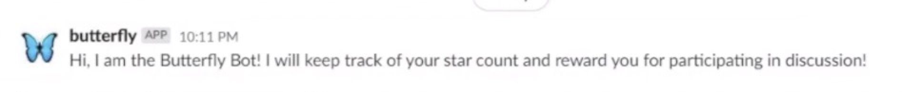
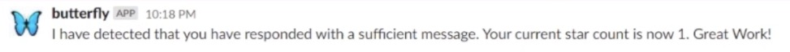
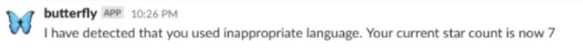
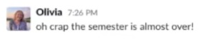
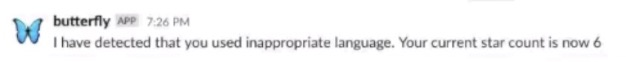

# Butterfly: rewarding students for what matters

### Problem Statement
In today's climate, there are many students getting their academic lives uprooted as they are forced to attend school from home. While this is a somewhat feasible feat for college-aged students, many young learners in elementary and middle school are struggling with not only their educational, but also social lives being disrupted. For young children, being socialized is just as important to the classroom experience as their lessons are, and these skills are sometimes referred to as “soft skills.” When students are forced to learn from home, they are not receiving proper socialization and learning those “soft skills” that a classroom is able to provide. While these students are at home with their families, they may be isolated from communicating with kids of their own age and suffering from feelings of isolation.

Therefore, we created a reward bot through Slack that rewards participation and punishes inappropriate behavior. With classes being moved online, we wanted to create an interactive Slackbot that could aid teachers and students alike from home! Our bot, Butterfly, can be implemented in schools forced to switch to online learning to promote productivity and enhance the learning and social experience for students. This would be a good solution for the current problem of schools switching to online learning to provide a fun and interactive way for students to participate in further discussion and as an additional tool for teachers.

### Primary Features
Butterfly recognizes when a user has sent their first message monitored by Butterfly, sending them a welcome message in a direct message and adding them to the Topcoder database.  
  

Butterfly gives rewards in the form of gold stars when students participate in discussion, namely when a student sends a message that is longer than five words in a channel being monitored by the bot. Butterfly sends the user a direct message notifying them about the change in their total star count.  
  
  

Additionally, our bot punishes bad behavior by taking away a star when students use unkind or inappropriate language.  
  
  

Butterfly will not reward a student for participating in discussion with a message longer than five words if their message includes inappropriate language.  
  
  

### Screencast
[screencast link](https://drive.google.com/file/d/1j-UX2z-q-fMOp7NHpmA0h2tFnYRnUzcz/view?usp=sharing)

### Reflection
see our individual reflections in [hw 5 folder](Homework%205/)

### Limitations
The group found that they were somewhat limited when it came time to see their bot through the theoretical stages to a real, functioning bot. Something they found that really limited them was deploying the bot on Slack as opposed to Discord, which some other groups in the class utilized. The team found that an event-based bot is not as user-friendly to set up and though they attempted to create one at first, they found that it was difficult to connect the bot code to the URL at which Slack would post event updates, which was attempted through a Firebase function in this case. This then caused the team to switch to implementing a classic Slackbot with a Node.js library aimed at easily interfacing with Slack's Real Time Messaging (RTM) API. Although this library made many features easier to implement, the team was also limited in what features they would be able to implement.

Through the use of the RTM API, the team was able to store users in a database based off of their unique user id, interact with the user, and monitor the messages they sent within channels montinored by the bot. However, the bot was unable to store a user's display name in the database, nor could it differentiate a student from a teacher (based on whether or not a user is an admin). While the team was still able to implement the most important functionality, they felt as though they were limited in adding features that would have enhanced the bot.

### Future Work
As discussed in the limitations, there were certain features that the team would have liked to implement, but were somewhat restricted. If given the opportunity to add additional features, the team would have needed dedicate time to researching more of the RTM API or switching the type of bot they created altogether (such as to using the events API). They felt this was not feasible within the time constraints, but if executed, the additional features the team would work to include are as follows:
* Display a leaderboard of students' star counts in descending order
* Implement teacher-specific functions, such as notifications regarding star deductions, the ability to edit the bad words list, the ability to set various restrictions for gaining a star, and the ability to turn Butterfly on or off
* Turn the bot on or off for specific threads within a channel
* Integrate images and visuals for when students are rewarded with a star
